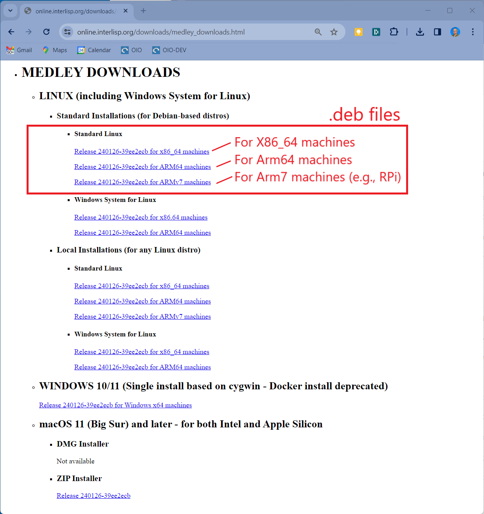
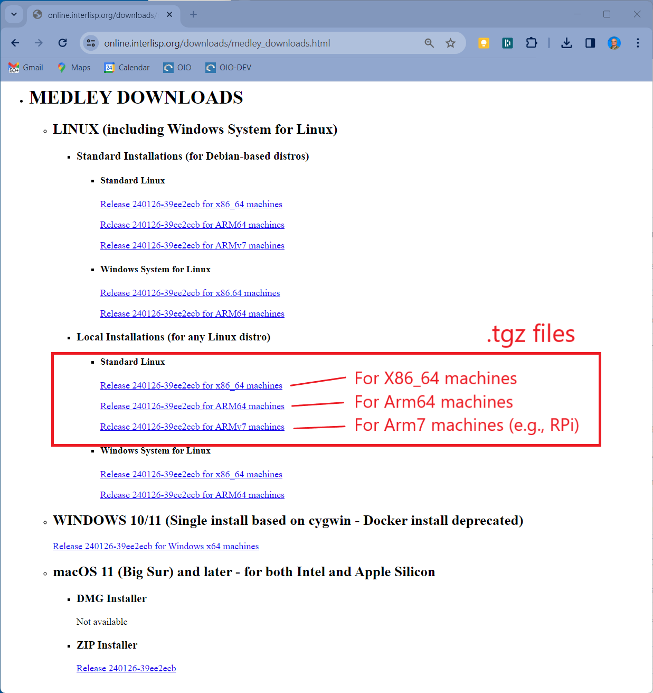
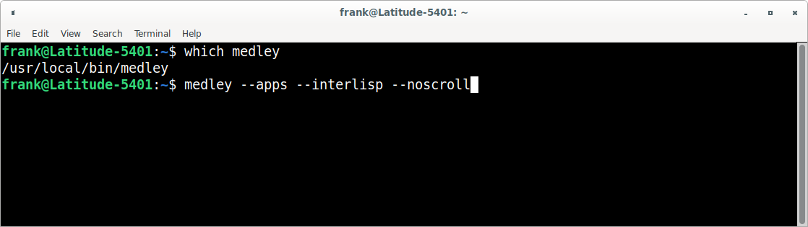
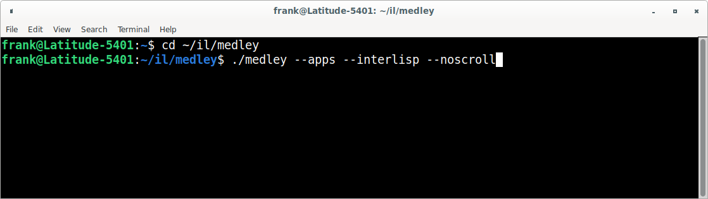
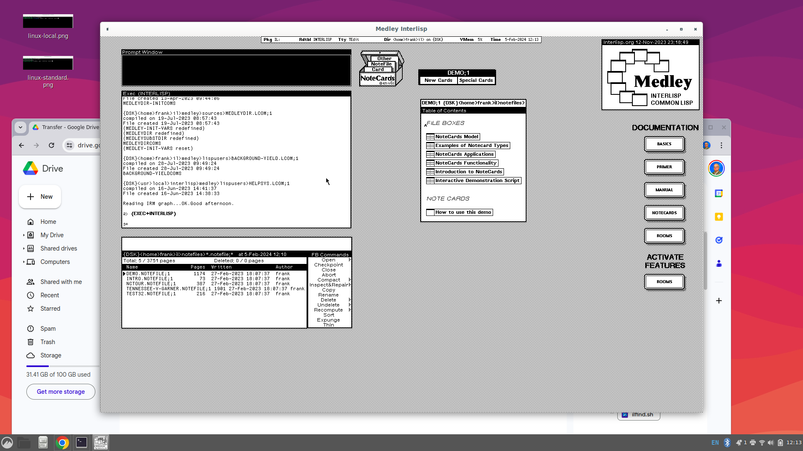

---
title: Install and Run on Linux
linkTitle: Linux
weight: 20
aliases:
 - /software/install-and-run/running-on-linux/
type: docs
---
<style>.td-content blockquote { border-left: none; color: inherit; padding-left: 2rem;}</style>

*Note that these instructions do not apply to Linux distros running within Windows System For Linux (WSL).  Separate instructions are available for WSL [here](../windows/wsl).*

Medley installs and runs on most recent Linux distros (Alpine Linux is one exception).  All that is strictly required is that the distro include an X Windows server.   Most of the testing for Medley has been done on Ubuntu 20.04 and 22.04.

We also recommend that the Linux system have a web browser installed.  A browser is not strictly necessary to run Medley, but several features of the system (e.g., displaying some user documentation) will not work without a browser installed.

## **Install Medley**

Medley can be installed on Linux in one of two configurations: *standard* and *local*. 

* Standard installation is available only for Debian-based distros (e.g., Debian, Ubuntu, MX Linux, Mint Linux, etc.).  It will install Medley into system directories (i.e., /usr/local/interlisp) and automatically install any prerequisite packages.
* Local installation will install Medley into any user directory but any prerequisite packages must be installed manually.

Standard installations are ideal for users who want to explore Medley (including its system code) or to develop applications built on top of Medley.  Standard installations are not good for users who want to modify the Medley system code, since that code is installed in protected locations.

### **Standard Installation (for Debian-based distros only)**

1.  Download the installation file (.deb) for the latest release from the [Medley downloads site](https://online.interlisp.org/downloads/medley_downloads.html)  from under the heading Linux/Standard/Linux.  There are are separate .deb files for X86_64, Arm64 and Arm7 (e.g., Raspberry Pi) systems.  Download the one that corresponds to your machine architecture.  We will refer to the downloaded file as ***\<deb_filepath>***

 <div align="center"><p>&nbsp;</p></div>

   > >Alternatively, you can download the .deb files for the current or any previous release from the Medley Releases page on the Interlisp GitHub site.  [Instructions for this can be found here](./linux-standard-from-github).

2.  Into any  Linux terminal, enter the following commands.  This will install Medley and all prerequisite packages.

	```
	ubuntu@oio:~$ sudo apt update
	ubuntu@oio:~$ sudo apt install -y <deb_filepath>
	```
	
### **Local Installation**
1.  Create a directory into which Medley will be installed.  We will refer to this directory as ***\<install_dir>***

2.  Download the release tar file (.tgz) for the latest release from the [Medley downloads site](https://online.interlisp.org/downloads/medley_downloads.html)  from under the heading Linux/Local/Linux.  There are are separate .tgz files for X86_64,  Arm64 , and Arm7 (e.g., Raspberry Pi) systems.  Download the one that corresponds to your machine architecture.  We will refer to the downloaded file as ***\<tgz_filepath>***
 
<div align="center"><p>&nbsp;</p></div>

   > >Alternatively, you can download the .deb files for the current or any previous release from the Medley Releases page on the Interlisp GitHub site.  [Instructions for this can be found here](./linux-local-from-github).

3. Untar ***<tgz_filepath>*** using the following command:
   ```
   ubuntu@oio:~$ tar -xz -C <install_dir> -f <tgz_filepath>
   ```
4.  Using the package manager for your distro (e.g., apt for Debian and Ubuntu distros), install the following packages:
a) man-db
b) xdg-utils
c) tigervnc
> ***Notes:***

> 4.1.  If *xdg-utils* is not available for your Linux distro, then Medley will still run well, with the exception of a few sub-systems that require opening external (to Medley) files.

> 4.2. On Debian-based systems (including Ubuntu), the *tigervnc* package is not available.  Instead install both the *tigervnc-standalone-server package* and the *tigervnc-xorg-extension* package.

## **Multiple Installations**
**Standard Installations**
Multiple standard installations are not possible.  It is possible to have a single Standard installation alongside one or more Local installations.

**Local Installations**
For local installations, you can install multiple copies of Medley (e.g. different releases).  Simply place each installation into a separate ***install_dir***. And follow the install instructions above.

Each Medley installation so installed will operate independently of other Medley installations.  The Medley system code for each installation will remain separate. However, in general the installations will share a single file system. So care must be taken to coordinate access to the file system.

## **Update Medley**
To update any given Medley installation (e.g., to install a new release), download the updated .deb or .tgz installer file as described above.  Then (re)run the appropriate install procedure as described above.

The chosen Medley installation will be updated.  Any user files (i.e., files created by the user that are not part of the Medley distribution) in the Medley file system will remain intact.

## **Run Medley**
Medley is started from any Linux terminal using the following commands.
##### **Standard Installations**
```
medley <flags and options>
```
   Example:


##### **Local Installations**
```
cd <install_dir>
./medley <flags and options>
```
   Example:


Documentation for the `<flags and options>` to the `medley` command can be found [here](https://online.interlisp.org/downloads/man_medley.html)

For first-time users: `medley --vnc --apps --interlisp --noscroll` or, equivalently, `medley -v -a -e -n` is a good starting point.  This will give you a fully populated Medley system, including the applications built on Medley such as Notecards and Rooms.

This will bring up the Medley environment in a separate Window on your Linux desktop.  The Medley desktop and windows will all be contained within this Window as shown below.




## **Use Medley**
Once Medley is up and running, see [here](software/using-medley/) for tips on how to navigate and use the Medley environment.

By default, Medley will use (creating, if necessary) a directory called *$HOME/il*.  This will be used by the Medley system as its *LOGINDIR* as follows:
 
  1.  Medley will start up with *LOGINDIR* as its current connected directory.

   2. Medley will load any personal init file from *LOGINDIR*/INIT or *LOGINDIR*/INIT.LCOM. 

   3. Medley will use *LOGINDIR*/vmem/ to store its virtual memory file(s).  
 
 The location of *LOGINDIR* can be changed using the `--logindir` option to `medley`.  In particular, if you have multiple installations of Medley that you would like to keep completely separate, then you can use the `--logindir` option to ensure the *LOGINDIR* for each installation is unique.

To exit Medley, type ```(IL:LOGOUT)``` at any Exec window prompt.


