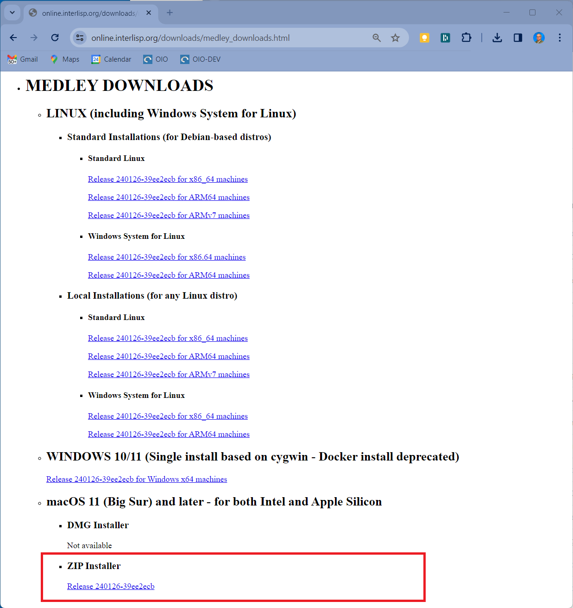

<style>.td-content blockquote { border-left: none; color: inherit; padding-left: 2rem;}</style>

## **Prerequisite: Install XQuartz**

Before installing and running Medley on your Mac, you will need to download and install XQuartz - an open-source X11 Windows server for the Mac.  You can download the latest XQuartz .pkg from  [XQuartz.org](https://xquartz.org) and install it using the MacOS installer.

If you do not have a three-button mouse on your Mac, you will need to set `Emulate three button mouse` in the XQuartz preferences.        

>To do so, start XQuartz (e.g., by double clicking the XQuartz icon within Launchpad). Select XQuartz->Preferences from the menu bar. In the Preferences dialog, select the Input tab and then check the *Emulate three button mouse* option.

## **Install Medley**

Medley releases on MacOS are distributed as a .zip file.  The .zip file contains universal binaries so that the same file can be used for either Intel or Apple Silicon machines.

To install Medley:

1. Download the latest release .zip from the [Medley downloads page](https://online.interlisp.org/downloads/medley_downloads.html), under the heading "MacOS ...".

 <div align="center"><p>&nbsp;</p></div>

>> You can also download the installation .zip file for the latest as well as any prior releases from the Medley Releases page on the Interlisp GitHub site. Instructions for this can be found [here](macos-from-github). 

2.  Copy the downloaded *medley-full-macos-universal...zip* file (which MacOS treats as an unzipped folder) from the Downloads folder into any folder of your choosing.  Optionally,  rename the target folder of the copy from *medley-full-macos-universal...* to something more manageable - e.g., *medley-latest*.  For the purposes of these instructions, we will call this (renamed) folder the *\<medley_folder>*.

3. In a Terminal window, you will need to remove the quarantine attributes from the executable files by executing the following command:

```
   xattr -d com.apple.quarantine <path to medley_folder>/maiko/darwin.universal/lde*
```
For example (assuming *\<path to medley_folder>* is *~/il/medley-latest*): 

```
    ssd@Mac-mini ~ % xattr -d com.apple.quarantine ~/il/medley-latest/maiko/darwin.universal/lde*
```
## **Multiple Installations**
You can install multiple copies of Medley (e.g. different releases).  Simply make sure the *<medley_folder>* for each installation has a unique pathname and then follow the install instructions above.

Each Medley installation so installed will operate independently of other Medley installations.  The Medley system code for each installation will remain separate. However, in general the installations will share a single file system. So care must be taken to coordinate access to the file system.

## **Update Medley**
To update any given Medley installation (e.g., to install a new release), download the updated .zip installer file as described above.  

The simplest update would be to delete the original *\<medley_folder>* and install the updated zip file as described above.  However, this will delete any files/folders added by the user to *\<medley_folder>*.

To preserve any user added files in *\<medley_folder>*, you instead need to open a Terminal and execute the following command: 
```
    cp -rp <path to downloaded zip folder> <path to medley_folder>
```

For example (assuming that ***\<medley_folder>*** is *~/il/medley2* and that the updated .zip folder is *~/Downloads/medley-full-macos-universal-240126-39ee2ecb_231112-42477318/*):
```
    ssd@mini ~ % cp -rp ~/Downloads/medley-full-macos-universal-240126-39ee2ecb_231112-42477318/* ~/il/medley2
```
The chosen Medley installation will be updated.  Any user files (i.e., files created by the user that are not part of the Medley distribution) in the Medley file system will remain intact.
	
## **Run Medley**

On MacOS, Medley must be started from a Terminal window.

At the Terminal prompt, you need to execute the  following commands: 
```
    cd <path to medley_folder>/medley`
    ./medley <flags and options>
  ```

For example: 
```
    ssd@Mac-mini ~ % cd ~/il/medley-latest/medley
    ssd@Mac-mini medley % ./medley --apps --interlisp --noscroll
```
Note that the first time you run it, Medley may take 10-15 seconds to start up as it starts the XQuartz X Windows server (assuming that it is not already running).
>You can optionally start the XQuartz server manually before starting Medley.  It will take 10-15 seconds to start up and then display an Xterm window in the upper-left corner of the screen.  You can just close this Xterm window.

Documentation for the `<flags and options>` to the `medley` command can be found [here](https://online.interlisp.org/downloads/man_medley.html)

For first-time users: `medley --vnc --apps --interlisp --noscroll` or, equivalently, `medley -v -a -e -n` is a good starting point.  This will give you a fully populated Medley system, including the applications built on Medley such as Notecards and Rooms. It will also start with a Interlisp Exec window (instead of the default Xerox Common Lisp Exec window).

This will bring up the Medley environment in a separate window on your desktop.  The Medley desktop and windows will all be contained within this window as shown below.


## **Use Medley**
Once Medley is up and running, see [here](/software/using-medley/) for tips on how to navigate and use the Medley environment.

By default, Medley will use (creating, if necessary) a directory called *$HOME/il*.  This will be used by the Medley
system as its *LOGINDIR* as follows:
 
  1.  Medley will start up with *LOGINDIR* as its current connected directory.

   2. Medley will load any personal init file from *LOGINDIR*/INIT or *LOGINDIR*/INIT.LCOM. 

   3. Medley will use *LOGINDIR*/vmem/ to store its virtual memory file(s).  
 
 The location of *LOGINDIR* can be changed using the `--logindir` option to `medley`.  In particular, if you have multiple installations of Medley that you would like to keep completely separate, then you can use the `--logindir` option to ensure the *LOGINDIR* for each installation is unique.

To exit Medley, type ```(IL:LOGOUT)``` at any Exec window prompt.


