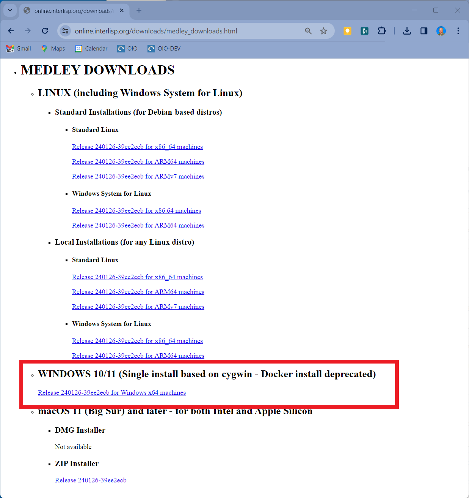
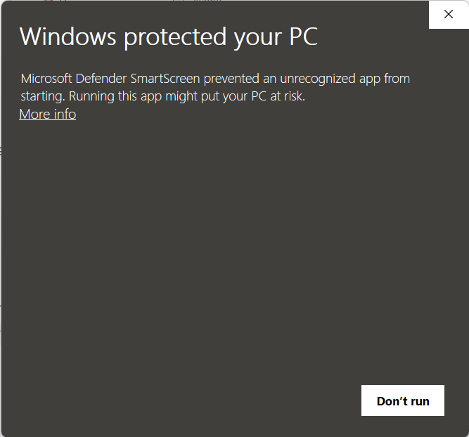
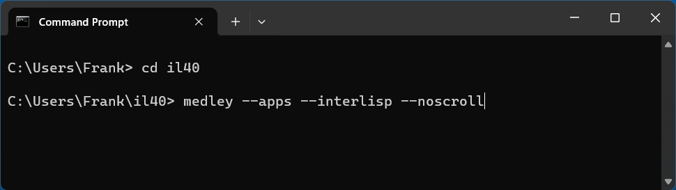
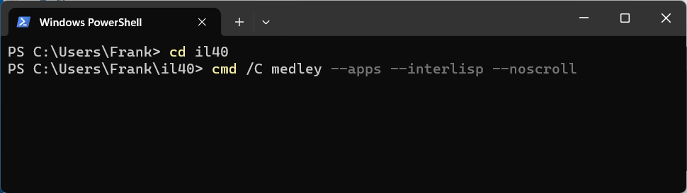

---
title: Install and Run on Windows "native"
linkTitle: native
weight: 40
type: docs
aliases:
 - /software/install-and-run/running-on-win/
---

<style>.td-content blockquote { border-left: none; color: inherit; padding-left: 2rem;}</style>

When running on Windows natively, Medley will be installed into a directory of your choice.  This directory will contain an isolated copy of the Cygwin environment (an adaptation of Linux tools and apps to Windows) and a version of Medley that runs within that specific Cygwin environment.  This presence of Cygwin, however, is largely hidden from the user and Medley behaves as if it is a native Windows app.

## Install Medley

1. Download the native Medley Windows installer for the latest release from under the Windows 10/11 heading on the [Medley downloads page](https://online.interlisp.org/downloads/medley_downloads.html).
 <div align="center"><p>&nbsp;</p></div>

&nbsp;

   > >Alternatively, you can download the Medley Windows installer for the current or any previous release from the Medley Releases page on the Interlisp GitHub site.  [Instructions for this can be found here](windows-native-from-github).
 
 2. Start the Medley installation app (e.g., by double clicking on the .exe just downloaded).

>The installation app will ask for the directory in which to install Medley.  Any directory that you have read/write access to will suffice. (We will refer to this directory as the Medley ***install_dir***.)

> The installation app will then copy the Medley files into the specified directory. It will also run the Cygwin installer to install Cygwin into the specified directory as well.

> **Note:**  To run the installation app, you may have to bypass the Windows security protections against running .exe files downloaded from the web.  For example, if the following dialog appears, you will need to select the `More info` link and then click on the `Run anyway` button that appears.

 <div align="center"><p>&nbsp;</p></div>

## Multiple Installations
You can install multiple copies of Medley (e.g. different releases) on a single Windows.  Simply run the Medley installation app and choose a different ***install_dir*** than any previous Medley installation.

Each Medley installation so installed will operate independently of other Medley installations, including having a separate Medley file system.

## Update Medley
To update any given Medley installation (e.g., to install a new release), download the updated native Medley Windows installer as per Step 1 in the **Install Medley** section above.

Run the installer app just downloaded and select the ***install_dir*** for the Medley installation you are updating.

The chosen Medley installation will be updated.  Any user files (i.e., files created by the user that are not part of the Medley distribution) in the Medley file system will remain intact.

## Run Medley
Once it is installed, you can start Medley from either a Command window or a Powershell window.  You cannot (currently) start Medley from the Start Menu or from an icon on the desktop.

   From a Command window, type:
   ```
   cd <install_dir>
   medley <flags and options>
   ```
   
   Example:

   
   From a Powershell window, type:
   ```
   cd <install_dir>
   cmd /C medley <flags and options>
   ```

Example:


Documentation for the `<flags and options>` to the `medley` command can be found [here](https://online.interlisp.org/downloads/man_medley.html)

For first-time users: `medley --apps --interlisp --noscroll` or, equivalently, `medley -a -e -n` is a good starting point.  This will give you a fully populated Medley system, including the applications built on Medley such as Notecards and Rooms.

This will bring up the Medley environment in a separate Window on your Windows desktop.  The Medley desktop and windows will all be contained within this Window as shown below.


## Use Medley
Once Medley is up and running, see [here](/software/using-medley/) for tips on how to navigate and use the Medley environment.

To exit Medley, type ```(IL:LOGOUT)``` at any Exec window prompt.

## Important Notes
1. The file system from Medley's perspective differs somewhat from the file system from Window's perspective.   Specifically, within Medley, the file system root (i.e., "{DSK}/" or "{UNIX}/") is mapped to the ***install_dir*** in the Windows file system.  For example, if ***install_dir*** is ***C:\Users\Frank\Medley1***, then the Medley file known as ***{DSK}\<testdir>testfile.txt*** will be located in the Windows file system at  ***C:\Users\Frank\Medley1\testdir\testfile.txt*** 

2. Also, from Medley you can refer to any file on a Windows drive using the reference ***{DSK}/[drive letter]/*** (or equivalently ***{DSK}<[drive letter]>***).  For example, ***C:\User\Frank\Downloads\testfile.txt*** in Windows will be  ***{DSK}/c/User/Frank/Downloads/testfile.txt*** in Medley.

3. Your Medley LOGINDIR will be  ***/home/&lt;name>/il***  (or ***&lt;install_dir>\home\\&lt;name>\il***  from the Windows perspective), where ***&lt;name>*** is your Windows username.  
4. Medley code is stored in  ***/medley***  (or ***&lt;install_dir>\medley***  from the Windows perspective).
5. If you want to work with the Medley code using git, etc. You will probably find it easier to work with git within Cygwin rather than work with git in Windows. To work within the Medley-specific Cygwin, within a Powershell or Command window:

   ```
   PS C:\Users\Frank> cd <install_dir>
   PS C:\Users\Frank> .\bin\bash -login
   $ git clone https://github.com/Interlisp/medley.git gmedley
   $ cd gmedley
   $ git status
   ```

   This will get you a bash terminal running under the Medley-specific Cygwin - which means that the file names will be the same as in Medley.

6. The Medley-specific Cygwin install is rather minimal, so if you find you need other Linux tools to work with the Medley code, the Cygwin setup tool (which also functions as its package manager) is available at  ***&lt;install_dir>\cygwin\setup_x86_64.exe***  (in Windows) or at  ***/cygwin/setup_x86_64.exe***  (from within Cygwin bash).

