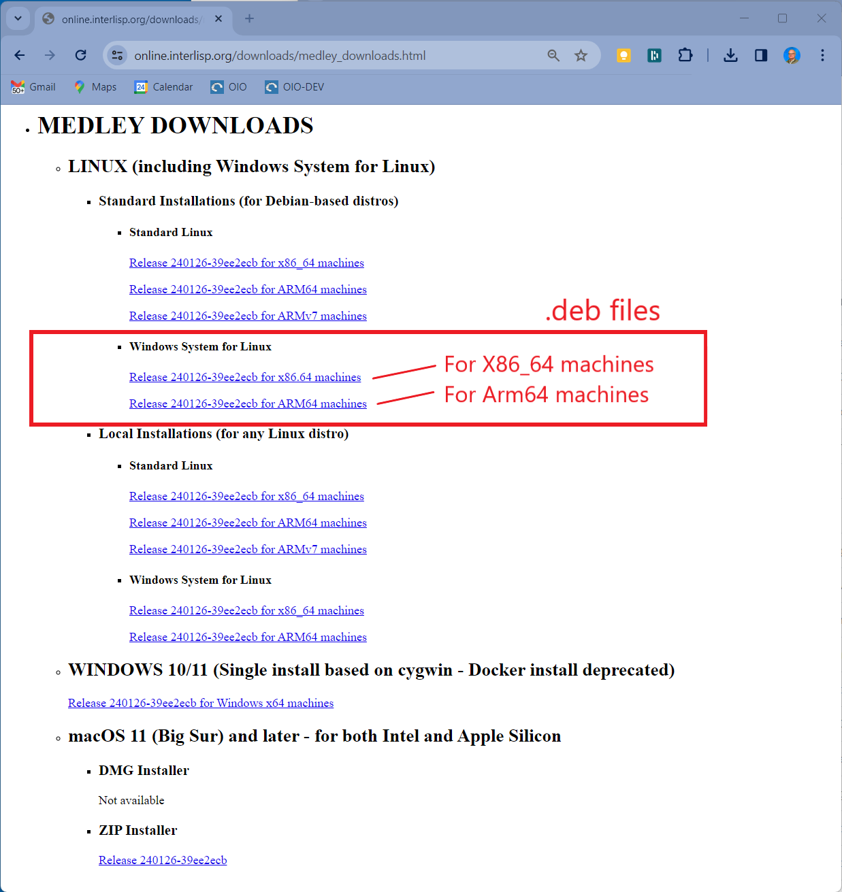
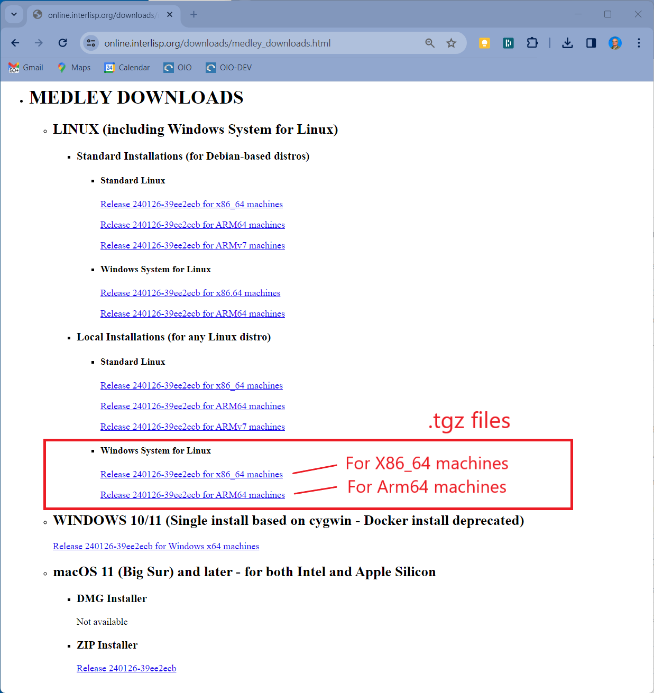
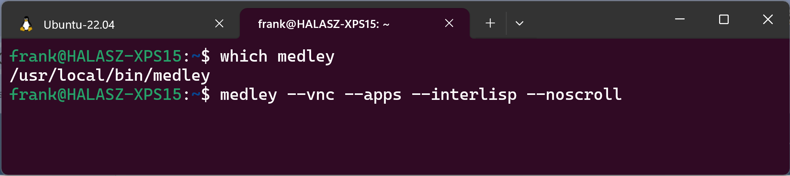
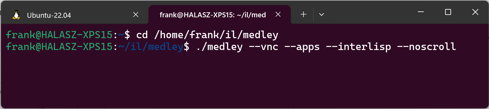
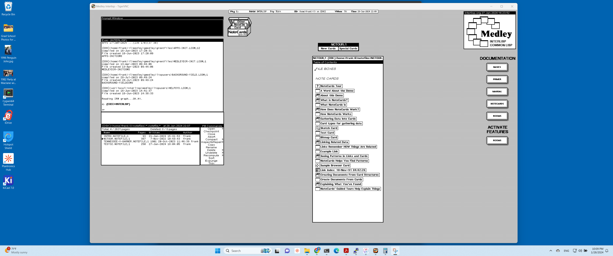

---
title: Install and Run on Windows with WSL
linkTitle: WSL
weight: 20
type: docs
aliases:
 - /software/install-and-run/running-on-wsl/
---

### Prerequisite: Install WSL
Medley can be installed and run on either WSL1 or WSL2.  WSL2 is preferred, but for older machines that do not support virtualization (see
[here](https://learn.microsoft.com/en-us/virtualization/hyper-v-on-windows/reference/hyper-v-requirements))
or Windows builds prior to Windows 10 Build 19041, WSL1 will work just fine although it will be limited to the VNC mode (see below).

To install/activate WSL on Windows, see [How to install Linux on Windows with WSL](https://learn.microsoft.com/en-us/windows/wsl/install).  

To use WSL, you must install one or more Linux "distros" on top of WSL.   Medley has been tested most extensively on the Ubuntu (20.04 and later) distros.  But Medley can be installed and run on (almost) any of the Linux distros available for WSL (Alpine Linux, is one known exception).

## Install Medley

Medley can be installed on WSL in one of two configurations: *standard* and *local*. 

* Standard installation is available only for Debian-based distros (e.g., Debian, Ubuntu, MX Linux, Mint Linux, etc.).  It will install Medley into system directories (i.e., /usr/local/interlisp) and automatically install any prerequisite packages.
* Local installation will install Medley into any user directory but any prerequisite packages must be installed manually.

Standard installations are ideal for users who want to explore Medley (including its system code) or to develop applications built on top of Medley.  Standard installations are not good for users who want to modify the Medley system code, since that code is installed in protected locations.

### Standard Installation (for Debian-based distros only)

1.  Download the installation file (.deb) for the latest release from the [Medley downloads site](https://online.interlisp.org/downloads/medley_downloads.html)  from under the heading Linux/Standard/WSL.  There are are separate .deb files for X86_64 and ARM64 systems.  Download the one that corresponds to your machine architecture.  We will refer to the downloaded file as ***\<deb_filepath>***

 <div align="center"><p>&nbsp;</p></div>

   > >Alternatively, you can download the .deb files for the current or any previous release from the Medley Releases page on the Interlisp GitHub site.  [Instructions for this can be found here](windows-wsl-standard-from-github).

> ***Note***:  under WSL, you can download the file either using a Windows browser into the Windows file system or using a Linux browser into the Linux file system.  If you download into the Windows file system, you will need to copy the file from the Windows file system into the Linux file system for your distro.  See [Copy files from Windows to your WSL instance](https://megamorf.gitlab.io/2021/08/11/copy-files-from-windows-to-your-wsl-instance/).  

> In these instructions, ***\<deb_filepath>*** refers to a file in the Linux file system.
2.  Into a WSL terminal, enter the following commands.  This will install Medley and all prerequisite packages.

	```
	ubuntu@oio:~$ sudo apt update
	ubuntu@oio:~$ sudo apt install -y <deb_filepath>
	```
	
### Local Installation
1.  In the WSL file system for your distro, create a directory into which Medley will be installed.  We will refer to this directory as ***\<install_dir>***

2.  Download the release tar file (.tgz) for the latest release from the [Medley downloads site](https://online.interlisp.org/downloads/medley_downloads.html)  from under the heading Linux/Local/WSL.  There are are separate .tgz files for X86_64 and ARM64 systems.  Download the one that corresponds to your machine architecture.  We will refer to the downloaded file as ***\<tgz_filepath>***
 
<div align="center"><p>&nbsp;</p></div>

   > >Alternatively, you can download the .deb files for the current or any previous release from the Medley Releases page on the Interlisp GitHub site.  [Instructions for this can be found here](./windows-wsl-local-from-github).

> ***Note***: Under WSL, you can download the .tgz file either using a Windows browser into the Windows file system or using a Linux browser into the Linux file system.  If you download into the Windows file system, you will need to copy the file from the Windows file system into the Linux file system for your distro.  See [Copy files from Windows to your WSL instance](https://megamorf.gitlab.io/2021/08/11/copy-files-from-windows-to-your-wsl-instance/). 

>  In these instructions, ***\<tgz_filepath>*** refers to a file in the Linux file system.

3. Untar ***<tgz_filepath>*** using the following command:
   ```
   ubuntu@oio:~$ tar -xz -C <install_dir> -f <tgz_filepath>
   ```
4.  Using the package manager for your distro (e.g., apt for Debian and Ubuntu distros), install the following packages:
a) man-db
b) wslu
c) tigervnc
> ***Notes:***
> 4.1.  If *wslu* is not available via the standard package repos for your WSL distro, then see [the wslu wiki](https://wslu.wedotstud.io/wslu/install.html).  If *wslu* is still not available, then try installing the *xdg-utils* package instead.  If *xdg-utils* is not available either, then Medley will still run well, with the exception of a few sub-systems that require opening external (to Medley) files.

> 4.2. On Debian-based systems (including Ubuntu), the tigervnc package is not available.  Instead install both the *tigervnc-standalone-server package* and the *tigervnc-xorg-extension* package.

## Multiple Installations

### Standard Installations
Multiple standard installations are not possible on a single WSL distro.  It is possible to have a single Standard installation alongside one or more Local installations on a single WSL distro.

### Local Installations
For local installations, you can install multiple copies of Medley (e.g. different releases) on a single WSL distro.  Simply place each installation into a separate ***install_dir***. And follow the install instructions above.

Each Medley installation so installed will operate independently of other Medley installations.  The Medley system code for each installation will remain separate. However, in general the installations will share a single file system (which is the WSL file system for the distro). So care must be taken to coordinate access to the file system.

## Update Medley
To update any given Medley installation (e.g., to install a new release), download the updated .deb or .tgz installer file as described above.  Then (re)run the appropriate install procedure as described above.

The chosen Medley installation will be updated.  Any user files (i.e., files created by the user that are not part of the Medley distribution) in the Medley file system will remain intact.

## Run Medley
Medley is started from the WSL terminal for your distro using the following commands.
### Standard Installations
```
medley <flags and options>
```
   Example:


### Local Installations
```
cd <install_dir>
./medley <flags and options>
```
   Example:


Documentation for the `<flags and options>` to the `medley` command can be found [here](https://online.interlisp.org/downloads/man_medley.html)

For first-time users: `medley --vnc --apps --interlisp --noscroll` or, equivalently, `medley -v -a -e -n` is a good starting point.  This will give you a fully populated Medley system, including the applications built on Medley such as Notecards and Rooms.

This will bring up the Medley environment in a separate Window on your Windows desktop.  The Medley desktop and windows will all be contained within this Window as shown below.



###  X-Windows mode versus VNC mode
On WSL2, Medley will normally run using the X-Windows built into WSL to display the Medley window on the Windows desktop.  This works well as long a you do not have a hi-dpi monitor.  But X-Windows on WSL2 does not scale well and ignores the Windows display scaling settings.  On hi-dpi monitors, this often results in the Medley window being to small to use effectively.

By using the --vnc (or -v) option to the *medley* command, you can instruct Medley to display into a VNC viewer contained in a standard Windows window.  The VNC viewer window scales effectively on the Windows desktop and follows the Windows display scale settings.  The result is a much more useable Medley window on hi-dpi displays.

Aside from this scaling issue, running in VNC mode is no different from running in the default X-Windows mode on WSL2. 

For WSL1, X-Windows mode is not available - Medley is always run in VNC mode.

## Use Medley
Once Medley is up and running, see [here](/software/using-medley/) for tips on how to navigate and use the Medley environment.

To exit Medley, type ```(IL:LOGOUT)``` at any Exec window prompt.

## Important Notes
1. The file system from Medley's perspective corresponds to the file system from the Linux distro perspective.  Note that this differs somewhat from the file systems as seen from the Windows perspective.  See [Working across Windows and Linux file systems](https://learn.microsoft.com/en-us/windows/wsl/filesystems) for more information.
2. Your Medley LOGINDIR will be  ***/home/&lt;name>/il***  in the Linux file system, where ***&lt;name>*** is your login name for the WSL distro.  

