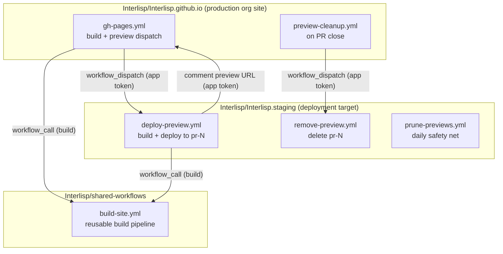
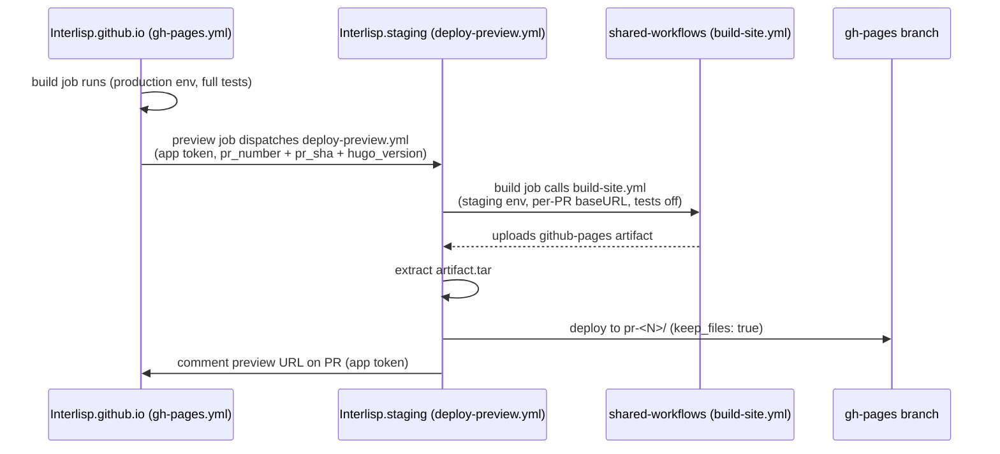

# Interlisp.org Staging Preview System: Design and Operations

This document describes the automated per-PR staging preview system for
[`Interlisp/Interlisp.github.io`](https://github.com/Interlisp/Interlisp.github.io),
which is the repository for the Interlisp.org website.

Every pull request to the production repository is automatically deployed to a
temporary staging site where it can be viewed and discussed before merging.
Previews are served from a separate repository's GitHub Pages *project site*,
each from a unique subdirectory URL, so multiple pull requests can be reviewed
simultaneously. The system stays entirely within GitHub — no third-party
services — and removes each preview automatically when its pull request is
closed or merged.

---

## Architecture



## Components

| Component | Purpose | Location | Key triggers |
|-----------|---------|----------|--------------|
| `Interlisp/Interlisp.github.io` | Production org site. Owns PR events: builds the site, triggers the staging preview, and triggers preview removal on PR close. | `.github/workflows/gh-pages.yml`, `.github/workflows/preview-cleanup.yml` | `push` / `pull_request` / `schedule` / `workflow_dispatch`; `pull_request: [closed]` |
| `Interlisp/Interlisp.staging` | Pure **deployment target** — never holds source code. Serves previews from its GitHub Pages project site. | `.github/workflows/deploy-preview.yml`, `.github/workflows/remove-preview.yml`, `.github/workflows/prune-previews.yml` | `workflow_dispatch`; daily `schedule` |
| `Interlisp/shared-workflows` | Org-level repo hosting the single reusable build workflow shared by production and staging, so build logic never drifts. | `.github/workflows/build-site.yml` | `workflow_call` |
| `Interlisp-staging-bot` | GitHub App used for cross-repo authentication (dispatch and comment steps). | — (registered in org developer settings) | — |

### Shared build pipeline (`build-site.yml`)

`build-site.yml` is a reusable workflow (`on: workflow_call`) that encapsulates
the entire build pipeline:

1. Check out the source repository at the given ref.
2. Query the Zotero API for the bibliography version and restore the cached
   bibliography (or rebuild it on a cache miss).
3. Install Hugo Extended, configure Pages, set up Node (v24), and `npm ci`.
4. Build with Hugo using the requested environment and an optional `--baseURL`
   override.
5. Optionally run the test suite (content-integrity, JSON-LD, and
   build-integrity tests).
6. Optionally upload the `github-pages` artifact.

Its inputs are `repository`, `ref`, `hugo-version` (required),
`hugo-environment` (required), `base-url`, `upload-artifact` (default `true`),
`run-build-tests` (default `true`), and `skip-if-fresh` (default `false`).
It exposes a `skipped` output, true when the build was skipped because
`skip-if-fresh` was set and the Zotero bibliography cache was already fresh.

Both callers pin the workflow at `@main` of `Interlisp/shared-workflows`.

## Preview lifecycle

### Deploy (PR open/update)



On every PR open/update to `main`, `gh-pages.yml` in the production repo:

1. The `build` job calls the shared reusable workflow
   (`build-site.yml@main`) with the production environment and
   `skip-if-fresh` (true only on scheduled runs).
2. The `preview` job — guarded to run only for pull requests from the same
   repository and only when the `STAGING_APP_ID` variable is set — mints a
   GitHub App token scoped to `Interlisp.staging` and dispatches
   `deploy-preview.yml` on the staging repo's `main` branch, passing
   `pr_number`, `pr_sha`, and `hugo_version`.

In the staging repo, `deploy-preview.yml`:

1. The `build` job calls the same shared reusable workflow against the PR head
   commit with `hugo-environment: staging`, the per-PR baseURL
   (`https://interlisp.github.io/Interlisp.staging/pr-<N>/`), and
   `run-build-tests: false`.
2. The `deploy` job downloads the `github-pages` artifact, extracts
   `artifact.tar`, and deploys the contents to the `pr-<N>/` subdirectory of
   the `gh-pages` branch via `peaceiris/actions-gh-pages@v4` with
   `keep_files: true` (so other previews are preserved). The deploy commit
   message and the run's job summary both state the exact deployed path.
3. Mints a second GitHub App token (scoped to `Interlisp.github.io`) and posts
   a comment on the source PR with the preview URL.

The `hugo_version` dispatch input keeps the production workflow's `HUGO_VERSION`
environment variable the single source of truth for the Hugo version across
both production and staging builds.

### Teardown (PR close/merge)

Teardown is two-tiered:

1. **Fast path:** `preview-cleanup.yml` in the production repo triggers on
   `pull_request: [closed]`, mints a token scoped to `Interlisp.staging`, and
   dispatches `remove-preview.yml` with the PR number. That workflow checks out
   the `gh-pages` branch, `git rm -r pr-<N>/`, commits, and pushes. It is
   hardened to no-op cleanly when the branch or subdirectory does not exist,
   and a `concurrency` guard prevents overlapping removals.
2. **Safety net:** `prune-previews.yml` runs **daily** (and is manually
   triggerable). It lists open PRs in `Interlisp/Interlisp.github.io`, then
   checks out `gh-pages` and removes any `pr-*` directory whose PR is no longer
   open. This guarantees no stale preview survives even if the fast path is
   missed or fails.

Both teardown workflows are guarded by `if: vars.STAGING_APP_ID != ''` so they
skip silently before app credentials exist.

## URLs

| Deployment | URL |
|------------|-----|
| Production | `https://interlisp.org` |
| Staging root | `https://interlisp.org/Interlisp.staging/` |
| PR #123 preview | `https://interlisp.org/Interlisp.staging/pr-123/` |
| PR #456 preview | `https://interlisp.org/Interlisp.staging/pr-456/` |

The org-site `CNAME` (`interlisp.org`) makes the staging project site reachable
under the custom domain at `https://interlisp.org/Interlisp.staging/`.

Previews are removed automatically when a PR is closed or merged.

## Cross-repo authentication

The default repo-scoped `GITHUB_TOKEN` cannot trigger workflows in another
repository, so a GitHub App identity is used. A short-lived installation token
is minted at runtime by `actions/create-github-app-token@v3`, scoped to exactly
the repository needed via the `repositories:` input:

```yaml
- uses: actions/create-github-app-token@v3
  id: app-token
  with:
    client-id: ${{ vars.STAGING_APP_ID }}
    private-key: ${{ secrets.STAGING_APP_PRIVATE_KEY }}
    owner: Interlisp
    repositories: |
      Interlisp.staging
```

Credentials are stored at the org level:

- `STAGING_APP_ID` — the app's **Client ID**, stored as an org **variable**.
- `STAGING_APP_PRIVATE_KEY` — the entire `.pem` file contents, stored as an org
  **secret**.

The `GITHUB_TOKEN` is used for the deploy and cleanup pushes, which stay inside
the staging repo.

## Configuration

- **GitHub App** (`Interlisp-staging-bot`), installed on both repos:
  - Actions: Read and write (trigger `workflow_dispatch` on the staging repo)
  - Pull requests: Read and write (post the preview URL comment)
  - Issues: Read and write (also accepted for the comment endpoint)
  - No webhook configured.
- **Pages:** staging repo serves from the `gh-pages` branch ("Deploy from a
  branch", not "GitHub Actions").
- **Staging config:** `config/staging/hugo.yaml` sets
  `baseURL: https://interlisp.github.io/Interlisp.staging/` and titles pages
  "Staging Environment".
- **Repo pins:** both callers pin the shared workflow at `@main` of
  `Interlisp/shared-workflows`.
- **`Interlisp/shared-workflows` `main`:** protected — all updates land via PR
  with one approving review; Dependabot opens monthly `github-actions` update
  PRs through the same path.

## Operational notes

- **Per-PR `baseURL` is passed at build time** via `--baseURL`, so each
  preview's absolute links resolve under its own `/pr-<N>/` path.
- **Fails safe:** the preview and cleanup jobs skip (rather than fail) for fork
  PRs or when `STAGING_APP_ID` is unset.
- **App permission changes do not retro-apply to existing installations.**
  After adding repository permissions to the app, an org owner must approve the
  change at the org's GitHub Apps settings; until then the comment step fails
  with HTTP 403 (`Resource not accessible by integration`).
- **Previews count against the 1 GB Pages limit** — each `pr-*` directory
  accumulates on the `gh-pages` branch.
- **Staging previews build with tests disabled** (`run-build-tests: false`)
  because the test suite's fixtures rebuild `public/` with the production
  environment and would clobber the staged artifact.

## Code References

| Component | File | Key actions |
|-----------|------|-------------|
| Production build + preview dispatch | `Interlisp/Interlisp.github.io/.github/workflows/gh-pages.yml` | `build` (calls `build-site.yml@main`), `preview` (mints app token, dispatches `deploy-preview.yml`), `deploy` (Pages deploy) |
| Preview removal trigger | `Interlisp/Interlisp.github.io/.github/workflows/preview-cleanup.yml` | Mints app token, dispatches `remove-preview.yml` on PR close |
| Preview deploy | `Interlisp/Interlisp.staging/.github/workflows/deploy-preview.yml` | `build` (calls `build-site.yml@main` with staging env + per-PR baseURL), `deploy` (extract artifact, push to `pr-<N>/`), comment URL on PR |
| Preview removal | `Interlisp/Interlisp.staging/.github/workflows/remove-preview.yml` | Checks out `gh-pages`, `git rm -r pr-<N>/`, commits, pushes |
| Stale preview prune | `Interlisp/Interlisp.staging/.github/workflows/prune-previews.yml` | Lists open PRs, removes any `pr-*` dir whose PR is not open |
| Shared build pipeline | `Interlisp/shared-workflows/.github/workflows/build-site.yml` | Zotero bibliography check/cache, Hugo Extended build, test suite, artifact upload |

## Glossary

| Term | Definition |
|------|------------|
| `pr-<N>/` | The subdirectory on the `gh-pages` branch (and URL path) that holds one PR's preview. |
| `github-pages` artifact / `artifact.tar` | The artifact uploaded by the shared build workflow; `artifact.tar` is extracted before deploying to a preview directory. |
| `workflow_dispatch` | A GitHub event used to trigger a workflow in another repository with inputs. |
| GitHub App installation token | A short-lived token minted at runtime from the app's credentials, scoped to specific repositories. |
| Org site vs. project site | An org site (`<org>.github.io`) is the account-level site; a project site (`<org>.github.io/<repo>`) lives under a repo name path. |
| `keep_files` | The `peaceiris/actions-gh-pages` option that preserves existing files in the destination directory (other previews) instead of replacing the branch. |
| `baseURL` override | The `--baseURL` passed to Hugo at build time so a preview's absolute links resolve under its own `/pr-<N>/` path. |
| `skipped` output | The shared build workflow's output indicating the build was skipped because the bibliography cache was fresh. |

## Future Work

- **Exclude the large static documentation tree from staging previews.** The
  `static/documentation` directory (~175 MB) is not needed for preview
  evaluation; excluding it would keep preview builds fast and reduce storage
  against the Pages limit.
- **Add a dedicated staging custom domain** (e.g., `staging.interlisp.org`)
  via the staging repo's own `CNAME` file for cleaner preview URLs.
- **Support previews for fork PRs.** The `preview` job currently skips PRs
  whose head repo differs from the base repo; enabling fork previews would let
  outside contributors get staging sites too.
- **Monitor preview storage.** Subdirectory previews accumulate on the
  `gh-pages` branch; consider retention tuning or alerting as PR volume grows.
- **Confirm teardown behavior in production.** The on-close fast path and the
  daily prune have been exercised; a final end-to-end observation on a real
  closed PR would fully validate cleanup.
